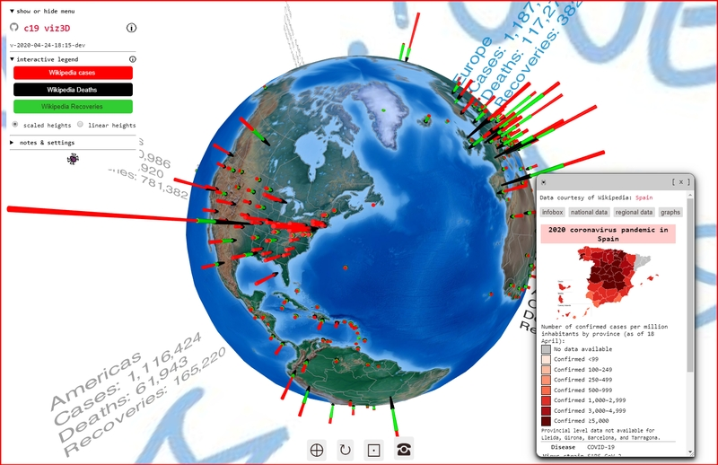

[You are now in a GitHub source code view - click this link to view Read Me file as a web page]( https://ladybug-tools.github.io/spider-covid-19-viz-3d/readme.html "View file as a web page." ) 

<input type=button onclick=window.location.href="https://github.com/ladybug-tools/spider-covid-19-viz-3d/";
value='You are now in a GitHub web page view - Click this button to view this read me file as source code' >

# [COVID-19 Viz3D Read Me]( #README.md )

<!--
<iframe src=https://ladybug-tools.github.io/spider-covid-19-viz-3d/dev width=100% height=500px >Iframes are not viewable in GitHub source code view</iframe>

_covid 19 viz 3d - touch me!_
-->

## Full Screen stable: [covid 19 viz3d]( https://ladybug-tools.github.io/spider-covid-19-viz-3d/ )

### Full Screen latest: [covid 19 viz3d/dev ]( https://ladybug-tools.github.io/spider-covid-19-viz-3d/dev/ )

### [Cookbook]( https://ladybug-tools.github.io/spider-covid-19-viz-3d/cookbook )

* Demos of the various modules used to build the viewer

### [Archive Gallery 2]( https://ladybug-tools.github.io/spider-covid-19-viz-3d/dev/covid-19-viz-3d-archive )

* Files for every daily project update since 200-03-19. Some files are better than others.

### [Archive Gallery 1]( https://ladybug-tools.github.io/spider-covid-19-viz-3d/dev/covid-19-statistics-on-globe )

* Files from the first day of the project

Concept

The concept of the web page is to show you the current COVID-19 situation around the entire world in 3 seconds or less.

* View the latest COVID-19 data from John Hopkins University [GitHub repository]( https://github.com/CSSEGISandData/COVID-19/tree/master/csse_covid_19_data ) with interactive 3D
* Provide entry-level programming code - plain-vanilla JavaScript - anybody can copy and make better
* Display all the data in seconds on any device then zoom and rotate and click to see the cases in 3D

The general idea is

* You want to access the latest global data
* You want to access the latest data for where you live
* You want to access "an expression of hope" even if the data is nasty

Mentions

* https://twitter.com/electricdisk/status/1240735764071288837
* https://discourse.ladybug.tools/t/spider-covid-19-viz-3d-web-page-updated-2020-03-17/8697/2
* https://www.reddit.com/r/COVID19/comments/fkjby9/view_the_latest_covid19_numbers_from_around_the/
* https://discourse.threejs.org/t/covid-19-viz-3d-interactive-3d-globe/13613/8

## Influences on the features

### [Issue #5 Expressions of hope]( https://github.com/ladybug-tools/spider-covid-19-viz-3d/issues/5 )

> @loleg I'm not sure how best to describe this, but what I wish for in an interactive viz like this, is the ability to discover what's hot and happening "out there". For example, the home page of gitter.im has more or less live messages from around the world. I wonder if we could show positive tweets and expressions of hope and gratitude for the courage of health workers around the world.

Sky Box as an "Expression of Hope"

* Zoom out then rotate. Trying to read the messages is a little guessing game.
* The text is huge and leaves much white space. This is so you are not totally distracted while looking at the data.

Messages of hope to add

* “Do what you can, where you are, with what you have.”

### Burning Man / Wild Wild West / Fair

Most of the time I try to create very simple, clean user experiences. Think Google's Material Design and Apple. I generally build tech stuff for techies.

But this is different. We want oldsters and children, tech and non-techies involved. We are seeing thus with painting abd drawing - a move from abstract to figurative, from minimal to pop-surreal.

The idea is to re-imagine the "chart", to turn the representation of quantities into more than mere the calligraphic scrawls we call "numbers".

### Love and Hate with the Earth as a globe

Some of the great things about the globe is that yoo know what to do with it. You can spin it, You know the top and bottom bits are kind of boring and not much happens there. You know where you live.

On the other hand, the Pacific Ocean takes half the space and there's nothing there either. And whenever other places of interest there tend to be a ton of then and it's very difficult to attach a sign to one place without covering up the next place.

To do and wish list 

### Generally / Short term

To Do

* Add stats to settings
* Start updating JHU modules
* State | regional data in its own div
* Notes as a thing
* Use main or HTML for init

#### Places

* Other large jurisdictions: Brazil, India, Indonesia, Russia

#### Indicator Bars

* Replay all stats individually - see last five days of just new cases
* Code in its own module
* Show some item of interest at the top of each indicator bar
	* As in all classical columns have a capital
	* Country or state flag?
	* Placards over each bar showing country - 2 letter identifier -  & # cases?
	* Ends on Red bars
	* Days since last new case indicated as color or opacity

#### Pop-ups

* 2020-04-18 ~ Theo ~  Pop-ups remember size and position between calls

#### Background

* 2020-04-15 ~ Theo ~  Background as a gradient
* 2020-04-15 ~ Theo ~  Sky box as Three.js text
* 2020-04-18 ~ Theo ~  Sky Box: add messages on the fly
* 2020-04-14 ~ Theo ~  Settings in their own modules

#### Sessions

* 2020-04-06 ~ Theo ~ Current settings save in local storage
	* Globe rotates to the lat/lon onload as set and saved in localStorage
	* Multiple locations & zoom levels
	* Scaled or linear heights
* Location hash goes to place and set language and other aspects

#### "Expressions of Hope"

* Translations with workflow for producing translations
* Twitter API
* Add to telephone messages
	* Random messages
	* In browser language
* Notes to pop-up
* Add "expressions of hope" such as positive tweets - in language?

### Medium Term

Vision of the future

* New organization?
* Better geoJson parser JavaScript function
* Separate timeline pages
* web pages for counties/provinces
* Add sound/music? During mouseover and at mouse click or data update
* Refresh data every few minutes

* Sun path? Mountains? Flamingos and dolphins?
* Rebuild oSome globe
* Themes? Mid-century modern, Burner, pixelated
* Rotation + zoom - 3D Lissajous path

### Statistics

* Community transmission vs traveller transmission
	* Data in WHO PDF file hard to parse
* a growing percentage affected per day of each country's population rather than cases detected if we're separating it out by country.
>> new cases in the past day.
> divided by the new cases the previous day. More cases is interesting, but far more interesting (to me, anyway) is that if it's increasing.
> I'd suggest the derivative of the above as well, as I'd like to know if the rate of growth is increasing or decreasing, but I might be the only one that would find that interesting.

### User forgiveness

* Set limits so cannot go too far north or south

Issues 

 Things you can do using this script

* Click the three bars( 'hamburger menu icon' ) to slide the menu in and out
* Click the GitHub Octocat icon to view or edit the source code on GitHub
* Click on title to reload te page
* Press Control-U/Command-Option-U to view the source code
* Press Control-Shift-J/Command-Option-J to see if the JavaScript console reports any errors

Credits and Links of interest

Data sources

* https://github.com/ulklc/covid19-timeseries
* https://coronadatascraper.com/#timeseries.csv
* https://github.com/datasets/covid-19/tree/master/data  ~ daily ?
* https://datahub.io/core/covid-19
* https://covidtracking.com/api/
* https://covidtracking.com/data/
* https://github.com/CSSEGISandData/COVID-19/tree/master/csse_covid_19_data
* https://github.com/M-Media-Group/Covid-19-API
	* https://opendata.arcgis.com/datasets/bbb2e4f589ba40d692fab712ae37b9ac_1.csv
	* https://mmediagroup.fr/covid-19
* https://nssac.bii.virginia.edu/covid-19/dashboard/
* http://globalcovid19.live/index.php/148-2/ ~ many interesting stats

Compare sources

* https://vitals.lifehacker.com/look-up-your-states-covid-19-test-results-with-this-tra-1842475525
* https://blog.datawrapper.de/coronaviruscharts/
* https://www.visualcapitalist.com/7-best-covid-19-resources/
* https://www.lewuathe.com/open-dataset-for-covid-19.html
* https://covid19dashboards.com/
* https://jarv.is/notes/coronavirus-open-source/
* https://ourworldindata.org/covid-sources-comparison

About Covid

* https://xapix-io.github.io/covid-data/
* https://covidnearyou.org/#!/

Map Tile Server lists

* https://www.trailnotes.org/FetchMap/TileServeSource.html
* http://geo.inge.org.uk/gme_maps.htm
* https://wiki.openstreetmap.org/wiki/Tile_servers

Dependencies

* https://threejs.org
* https://github.com/jdomingu/ThreeGeoJSON

Trackers

* https://towardsdatascience.com/top-5-r-resources-on-covid-19-coronavirus-1d4c8df6d85f

Other 3D visualizations of the COVID-19 data

* https://covidvisualizer.com/
* https://covid3d.live/
* https://icao.maps.arcgis.com/apps/webappviewer3d/index.html?id=d9d3f8fa9a23425c8f0889baab626186
* https://earth3dmap.com/coronavirus-interactive-global-map/
* https://coronation.xyz/
* https://covid19.martinpham.com/
* https://covidglobestats.com/
* https://coronaviz.netlify.com/

2D of interest

* https://rongchenguo.github.io/Coronavirus_Visual_Analytics/
* https://mtrajk.github.io/virus-spreading/

Geolocation

* https://www.w3schools.com/html/html5_geolocation.asp
* https://developer.mozilla.org/en-US/docs/Web/API/Geolocation_API

Globes

* https://github.com/vasturiano/three-globe
* https://github.com/vasturiano/globe.gl
* https://globe.chromeexperiments.com/

Source of bitmaps used on globe

* https://github.com/mrdoob/three.js/tree/dev/examples/textures/planets

TopoJson

* https://www.npmjs.com/package/world-atlas
* https://observablehq.com/@mbostock/geojson-in-three-js

geoJson

* https://datahub.io/collections/geojson
* https://github.com/nvkelso/natural-earth-vector
* https://github.com/maptime-ams/geojson-3d
* https://github.com/jdomingu/ThreeGeoJSON
* https://stackoverflow.com/questions/40520463/how-can-i-draw-geojson-in-three-js-as-a-mesh-and-not-a-line-and-fill-with-color
* https://bl.ocks.org/marcopompili/f5e071ce646c5cf3d600828ace734ce7

geoJson useful

* ne_110m_admin_0_countries_lakes.geoJson
* ne_110m_admin_1_states_provinces_lines.geoJson
* https://github.com/longwosion/geojson-map-china
* https://github.com/waylau/svg-china-map

wikipedia api

* https://en.wikipedia.org/w/api.php
* https://wikimedia.org/api/rest_v1/metrics/pageviews/per-article/en.wikipedia/all-access/user/Africa/daily/2017042700/201805170
	* https://medium.com/@mustaphamekhatria/get-wikipedia-pages-views-data-with-nodejs-54a265e0a78c

wiki geography

* https://en.wikipedia.org/wiki/List_of_countries_by_population_(United_Nations)
* https://en.wikipedia.org/wiki/List_of_sovereign_states
* https://en.wikipedia.org/wiki/List_of_countries_and_dependencies_by_population
* https://en.wikipedia.org/wiki/2019%E2%80%9320_coronavirus_pandemic_by_country_and_territory
* https://en.wikipedia.org/wiki/2020_coronavirus_pandemic_in_the_United_States

### WP Chart Templates

* https://en.wikipedia.org/wiki/Template:2019%E2%80%9320_coronavirus_pandemic_data/United_States_medical_cases_chart
* https://en.wikipedia.org/wiki/Template:2019%E2%80%9320_coronavirus_pandemic_data/

### Google DSPL

* https://github.com/google/dspl/blob/master/samples/google/canonical/countries.csv
	* 245 places identifier, lat & lon
* https://github.com/google/dspl/blob/master/samples/google/canonical/states.csv
	* identifier, lat & lon
* https://github.com/google/dspl/tree/master/samples/bls/unemployment
* https://github.com/google/dspl/blob/master/samples/bls/unemployment/counties.csv
	* counties lat & lon
* https://github.com/google/dspl/blob/master/samples/bls/unemployment/states.csv
	* states lat & lon, identifier, alternate name

### SEDAC

* https://sedac.ciesin.columbia.edu/data/collection/gpw-v4
* https://sedac.ciesin.columbia.edu/data/collection/gpw-v4/maps/services

### simplemaps

* https://simplemaps.com/data/us-cities
* https://simplemaps.com/data/world-cities << 15,000 cities

### JHU

* https://github.com/CSSEGISandData/COVID-19/blob/master/csse_covid_19_data/csse_covid_19_time_series/time_series_covid19_confirmed_global.csv
	* Has lat & lon

### Cool Three.js Globe handling

* https://threejsfundamentals.org/threejs/lessons/threejs-optimize-lots-of-objects-animated.html
* https://threejsfundamentals.org/threejs/lessons/threejs-optimize-lots-of-objects.html
* https://codeburst.io/improve-your-threejs-performances-with-buffergeometryutils-8f97c072c14b

### tests

* https://en.wikipedia.org/w/api.php?action=parse&format=json&origin=*&section=1&page=2019–20_coronavirus_pandemic_by_country_and_territory

Change log 

_Daily change logs are now in the v-dates/ folders._

_2020-04-25: To do and Wish List updates are now in [change-log.md](#change-log.md )_

***

# 
<a href=javascript:window.scrollTo(0,0); style=text-decoration:none; > ❦ </a>

